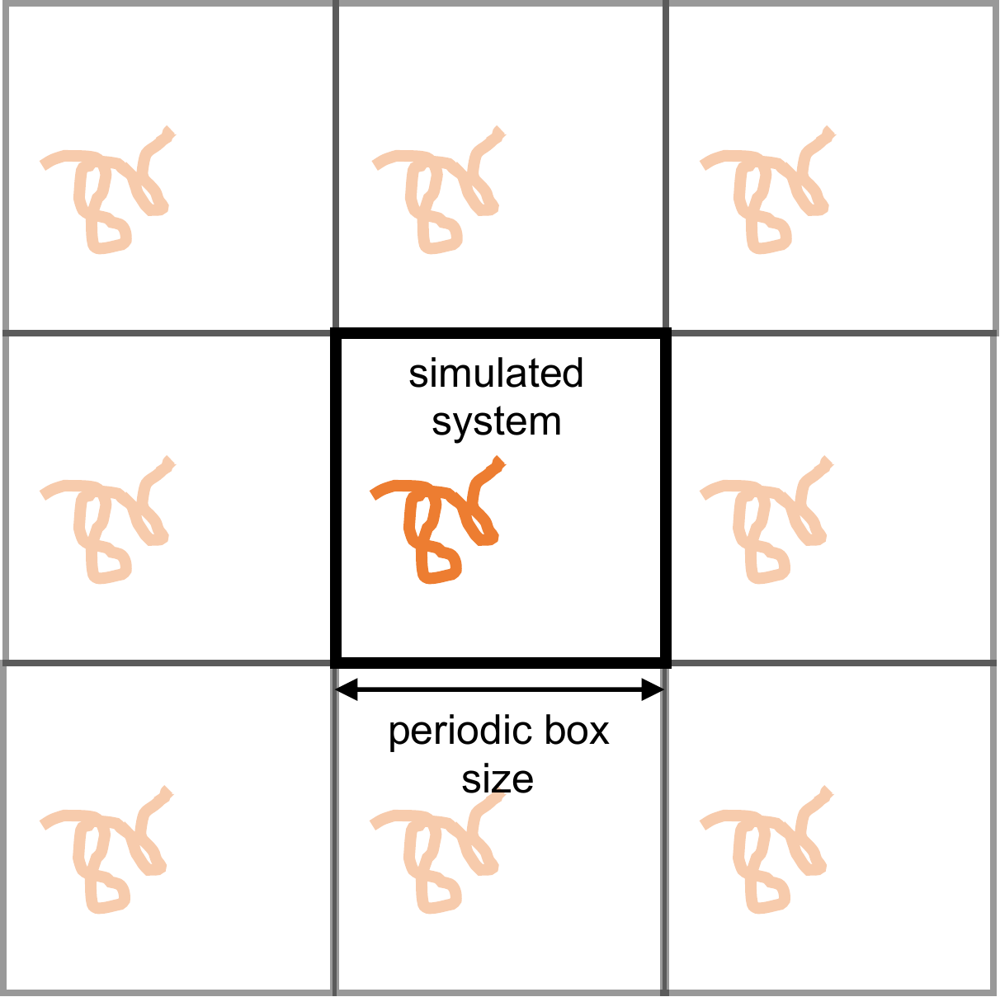
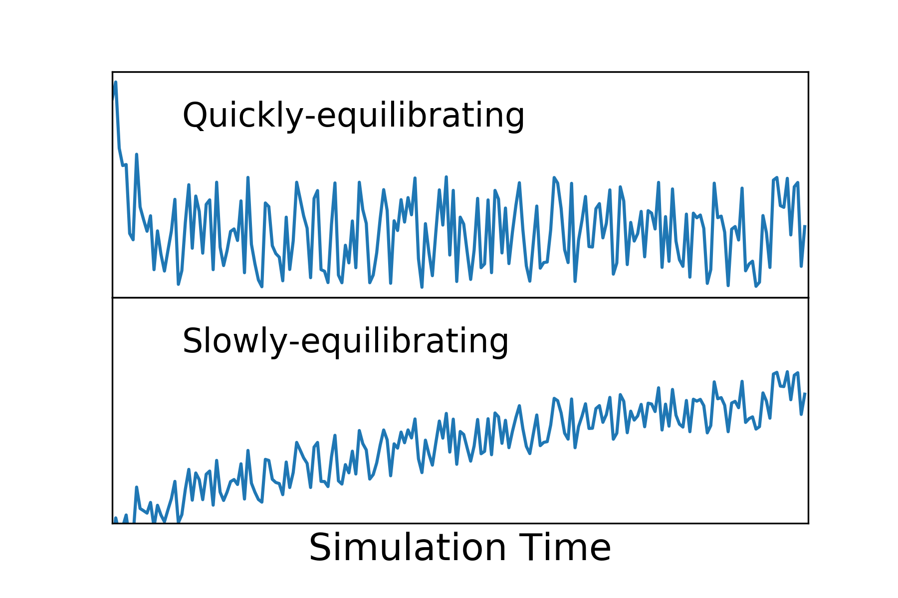

# BIOKT Lab Handbook, Chapter 3: Checklist for MD Simulations

**Status:** draft · **Last revised:** 2026-10-07

---

> **Source and licence.** This chapter is an adaptation of the checklist and
> surrounding text in
>
> E. Braun, J. Gilmer, H. B. Mayes, D. L. Mobley, J. I. Monroe, S. Prasad,
> D. M. Zuckerman, *Best Practices for Foundations in Molecular Simulations
> [Article v1.0]*, Living J. Comp. Mol. Sci. **1**, 5957 (2019).
> [doi:10.33011/livecoms.1.1.5957](https://doi.org/10.33011/livecoms.1.1.5957)
>
> developed openly at
> [github.com/MobleyLab/basic_simulation_training](https://github.com/MobleyLab/basic_simulation_training)
> and released under the
> [Creative Commons Attribution 4.0 International licence (CC BY 4.0)](https://creativecommons.org/licenses/by/4.0/).
> This chapter is distributed under the same licence.
>
> **What we changed.** We reordered the material into the stages of a project,
> turned it into tick boxes, shortened the wording, and added material specific
> to how the BIOKT group works (GROMACS, intrinsically disordered proteins,
> validation between stages, record keeping). Items taken from the article are
> paraphrased, with a few short phrases kept from the original wording;
> §7 and the group-specific items are ours. Any errors introduced in the
> adaptation are ours, not the original authors'.
> Figures 1 and 2 are reproduced from the article; each caption states what
> we changed.
>
> If you use this checklist in your own work, cite the original article, not
> this handbook.

---

## 1. Why this document exists

An MD simulation will almost always produce *something*: a trajectory, a
movie, a number. Whether that something means anything depends on decisions
made before the first step was integrated, many of which fail silently. The
worst outcome is not a crash; it is a system that is not what you intended
(wrong protonation state, missing ion, wrong water model) but is still
chemically valid, so it runs cleanly through every subsequent step.

This checklist collects the decisions that matter and the checks that catch
the most common mistakes. Go through it **before** you start a new project or
a new set of systems, and again before you show results. It does not replace
reading: for the concepts behind each item (ensembles, thermostats, long-range
electrostatics, integrators), read the original article, which was written for
exactly that purpose.

Keep the answers. Each decision below should be written down in
your lab notebook or project README (Chapter 2, §7), with the reason, when you
make it. "Why did you use this water model?" is a question you will be asked
by a referee long after you have forgotten the answer.

---

## 2. Should you run MD at all?

MD is a tool, and it may not be the right one for your question. Before
preparing anything:

- [ ] **Count the cost.** What is the timescale of the process you want to
      observe? Is it tractable given the size of your system, the computing
      time available and the cost per ns? If the relevant events take
      milliseconds or longer, plain MD will not reach them.
- [ ] Would the question be answered faster or more cheaply another way: an
      experiment, a collaborator, a simpler model?
- [ ] If the feasibility is unclear, plan a small set of **exploratory**
      simulations to measure it, rather than plunging into the full study.
- [ ] Have a rough idea of the statistical uncertainty you can expect, and
      whether it is small enough to answer the question (see §8).
- [ ] For enhanced sampling (metadynamics, umbrella sampling,
      replica exchange), the same question applies to the *chosen collective
      variables or replica ladder*: is there a reason to think they capture
      the slow process?

---

## 3. Take stock of your plans

- [ ] What question are you trying to answer, and what observable will answer it?
- [ ] Which ensemble do you need ($NVT$, $NPT$, $NVE$, $\mu VT$)?
- [ ] Which temperature, pressure and composition (salt concentration, pH,
      co-solvents)?
- [ ] Which reference state or experiment are you trying to reproduce or
      predict?
- [ ] Which force field properly describes your system?
- [ ] What is already known in the literature, and which data will you compare
      to?
- [ ] For intrinsically disordered proteins: force field *and*
      water model are a single choice. Combinations developed for folded
      proteins can produce disordered ensembles that are too compact. Check
      which combinations have been benchmarked for IDPs against data you can
      compare to (SAXS $R_g$, NMR chemical shifts and $J$-couplings, FRET,
      PRE), and justify your choice in writing.
- [ ] Decide now how many independent replicas you will run and
      from which starting structures (§6). This changes the cost estimate.

---

## 4. Prepare the system

- [ ] Choose a simulation package that supports your ensemble and your target
      force field. In the group this is normally GROMACS, but we
      also use Amber (AmberTools for parameterising small molecules) and
      OpenMM, each for different purposes. Whichever you use, run one of the
      installed versions on each machine, and record the package and
      version.
- [ ] Decide whether the system is bulk (fully periodic), an interface
      (partially periodic) or finite, and set periodicity and cutoffs
      accordingly.
- [ ] Prepare the system so that it contains the chemical components you
      intend, with the structures you intend. In particular check:
  - [ ] protonation states of titratable residues at your pH, and termini
        (charged, capped, or neutral as appropriate);
  - [ ] disulfide bonds, histidine tautomers, missing residues and atoms;
  - [ ] the net charge of the system before and after adding
        ions, and the final ion concentration;
  - [ ] that ligands or non-standard residues have parameters
        consistent with the main force field (e.g. GAFF2 with Amber-family
        protein force fields), with charges derived by the method that
        force field expects.
- [ ] Check that force field parameters are assigned as intended. Where
      possible, reproduce energies, forces or an observable from a previous
      publication with the same force field.
- [ ] Avoid starting structures with severe clashes; the starting structure
      should ideally resemble an equilibrium structure at your state point.
- [ ] Box size: the minimum distance between periodic images of
      the solute must exceed the cutoff throughout the simulation, not only at
      the start. For IDPs, which can extend far beyond their initial size,
      size the box for the expanded conformations you expect, and monitor the
      minimum image distance during production.

  

  *Figure 1. Periodic boundary conditions in two dimensions: the simulated
  system is surrounded by identical copies of itself. If the chain extends
  until it comes within a cutoff distance of its own image, it interacts with
  itself. Figure from Braun et al., LiveCoMS 1, 5957 (2019), CC BY 4.0;
  converted from PDF, caption rewritten.*

- [ ] **Do not assume the system is correct because it runs.** A badly
      prepared system often equilibrates without error. Inspect it visually
      and check its composition explicitly.

---

## 5. Choose simulation settings

### 5.1 Cutoffs and long-range interactions

- [ ] Electrostatics are long-ranged: for periodic systems use a full
      treatment of long-range electrostatics (in practice PME). For finite
      systems the cutoff must exceed the system size.
- [ ] Van der Waals interactions can usually be cut off at 1–1.5 nm,
      provided the box is at least twice the cutoff, but a long-range
      dispersion correction may be needed.
- [ ] Use well-validated or default settings for the method, and deviate only
      after careful consideration and testing.
- [ ] Cutoffs, switching or shifting functions and the dispersion
      correction are **part of the force field**. Use the settings with which
      the force field was parameterised (they differ between the Amber and
      CHARMM families), and cite where you took them from.

### 5.2 Thermostat, barostat and integrator

- [ ] Choose a thermostat that gives the correct *distribution* of kinetic
      energies, not only the correct average. For small systems, or systems
      with weakly coupled components, choose one that works in the
      small-system limit.
- [ ] Choose a barostat that gives the correct distribution of volumes.
- [ ] Consider the known shortcomings of integrators, thermostats and
      barostats, and whether they affect the properties you will calculate
      (e.g. strong coupling to a stochastic thermostat slows dynamics, which
      matters for diffusion or kinetics).
- [ ] In GROMACS terms: the Berendsen thermostat and barostat do
      not sample the correct ensemble and must not be used for production.
      `v-rescale` (thermostat) and `C-rescale` or `Parrinello-Rahman`
      (barostat) do. `Parrinello-Rahman` can oscillate badly far from
      equilibrium, so it is not suitable for the first steps of equilibration.

### 5.3 Timestep

- [ ] Identify the highest-frequency motion in the system (usually bond
      vibrations involving hydrogen, unless those bonds are constrained).
- [ ] As a first guess, set the timestep to about one tenth of the period of
      that motion.
- [ ] Test the choice: in the microcanonical ($NVE$) ensemble, total energy
      should be conserved with no significant drift.
- [ ] Standard practice with constrained bonds to hydrogen is
      2 fs. A 4 fs timestep requires hydrogen mass repartitioning; if you use
      it, say so, and run the energy-conservation test above, because this is
      exactly the case the test is for.

---

## 6. Plan the run protocol

The standard sequence is: system preparation → energy minimisation →
equilibration → production. The boundaries between these are not always
sharp.

- [ ] Plan how you will minimise and equilibrate, and **test** that your
      equilibration actually reaches equilibrium in the target ensemble.
      Typically: $NVT$ to reach the target temperature, then $NPT$ to reach
      the target density, before production in the target ensemble.
- [ ] Never collect production data immediately after a change in conditions
      (box rescaling, minimisation, a jump in temperature or pressure).
- [ ] Decide production length, and how often to save coordinates and
      energies. Saving far more often than the relevant correlation time
      fills disks with redundant data; saving energies and coordinates at
      commensurate intervals keeps structural and energetic analysis
      consistent.
- [ ] Check that you have enough storage, memory and computer time for the
      whole plan, replicas included.
- [ ] Independent replicas: different initial velocities give trajectories
      that diverge; different **starting configurations** give replicas that
      are independent from the outset, and are better.
- [ ] Base the protocol on the group's established GROMACS
      workflow and `.mdp` templates rather than writing one from scratch.
      Any departure from it (new flag, new option, workaround) needs a reason
      written down.
- [ ] Name stage outputs as described in Chapter 2, §3, from the
      first run.

### 6.1 A template script

If you have never set up a GROMACS simulation, work through a tutorial first:
Justin Lemkul's [Lysozyme in water](http://www.mdtutorials.com/gmx/) or the
official [GROMACS tutorials](https://tutorials.gromacs.org/). The script below
follows the same steps as *Lysozyme in water*. It is not meant to be run as
is. It shows how to write a setup script so that the choices made in §3–§5
appear **once**, at the top, and every file name is built from them:

- `model` is the molecular model: system, force field and water model. The
  topology and starting structure depend only on these.
- `name` is a simulation of that model under given conditions (here,
  temperature). Every output from NVT onwards carries it, plus the replica
  index.

Change the force field or temperature at the top, and every file name changes
with it. Nothing is overwritten and you never type a file name by hand. Run
it from the project root one stage at a time (`scripts/run_md.sh em`, then
`nvt`, ...), and check each stage's output (§7) before starting the next.
A copy of the script and of `ions.mdp` (below) is in `examples/gromacs/` of
the [project template](https://github.com/BioKT/simulation-project-template).

```bash
#!/usr/bin/env bash
# scripts/run_md.sh: set up and run one system, one stage at a time.
# Usage: scripts/run_md.sh <prep|em|nvt|npt|md> [replica]
set -euo pipefail

# ---- What this run is. Only these lines change between runs. ---------------
sys=as4             # system identifier, fixed for the whole project
ff=amber99sb-ildn   # force field, as pdb2gmx names it (an example only: not for IDPs, §3)
fftag=a99sb         # short tag for the force field in file names
wat=tip3p           # water model
temp=300            # temperature (K)
conc=0.15           # NaCl concentration (mol/L), on top of neutralising ions
stage=${1:?usage: $0 <prep|em|nvt|npt|md> [replica]}
rep=${2:-0}         # replica index, from 0
gmx=${GMX:-gmx}     # e.g. GMX=gmx_mpi where only the MPI build exists

# ---- Names, built from the choices above ----------------------------------
model=${sys}_${fftag}_${wat}    # e.g. as4_a99sb_tip3p
name=${model}_${temp}K          # e.g. as4_a99sb_tip3p_300K
top=setup/${model}.top
start=setup/${model}_start.gro  # solvated, neutralised starting structure
mkdir -p data/{prep,em,nvt,npt,md}

# grompp + mdrun for one stage: <stage> <output base name> <input .gro> [grompp options]
# The .mdp templates in setup/mdp/ contain @TEMP@ wherever the temperature goes.
run_stage() {
  local st=$1 out=$2 in=$3; shift 3
  sed "s/@TEMP@/${temp}/g" setup/mdp/${st}.mdp > ${out}.mdp
  $gmx grompp -f ${out}.mdp -c ${in} -p ${top} -po ${out}_mdout.mdp -o ${out}.tpr "$@"
  $gmx mdrun -deffnm ${out}
}

case $stage in
prep)
  # Topology. Check protonation states (§4); -his lets you choose histidines.
  (cd setup && $gmx pdb2gmx -f ${sys}.pdb -ff ${ff} -water ${wat} -ignh \
      -o ../data/prep/${model}_pdb2gmx.gro -p ${model}.top -i ${model}_posre.itp)
  # Box: 1.2 nm from solute to box edge. Not enough for an extended IDP (§4).
  $gmx editconf -f data/prep/${model}_pdb2gmx.gro -o data/prep/${model}_box.gro \
      -c -d 1.2 -bt dodecahedron
  case ${wat} in tip4p*) wbox=tip4p.gro ;; *) wbox=spc216.gro ;; esac
  $gmx solvate -cp data/prep/${model}_box.gro -cs ${wbox} -p ${top} \
      -o data/prep/${model}_solv.gro
  $gmx grompp -f setup/mdp/ions.mdp -c data/prep/${model}_solv.gro -p ${top} \
      -po data/prep/${model}_ions_mdout.mdp -o data/prep/${model}_ions.tpr
  echo SOL | $gmx genion -s data/prep/${model}_ions.tpr -p ${top} -o ${start} \
      -pname NA -nname CL -neutral -conc ${conc}
  ;;
em)
  run_stage em data/em/${model}_em ${start}
  grep -E "converged to|Potential Energy|Maximum force" data/em/${model}_em.log
  ;;
nvt)
  out=data/nvt/${name}_nvt_rep${rep}
  run_stage nvt ${out} data/em/${model}_em.gro -r data/em/${model}_em.gro
  echo Temperature | $gmx energy -f ${out}.edr -o ${out}_temperature.xvg
  ;;
npt)
  in=data/nvt/${name}_nvt_rep${rep}
  out=data/npt/${name}_npt_rep${rep}
  run_stage npt ${out} ${in}.gro -r ${in}.gro -t ${in}.cpt
  printf "Pressure\nDensity\n" | $gmx energy -f ${out}.edr -o ${out}_pressure_density.xvg
  ;;
md)
  in=data/npt/${name}_npt_rep${rep}
  run_stage md data/md/${name}_md_rep${rep} ${in}.gro -t ${in}.cpt
  ;;
*)
  echo "unknown stage: ${stage}" >&2; exit 1 ;;
esac
```

The temperature enters the `.mdp` templates through a placeholder, e.g. in
`setup/mdp/nvt.mdp`:

```
define    = -DPOSRES      ; restrain the solute while the solvent relaxes
tcoupl    = v-rescale
tc-grps   = System
tau_t     = 0.1
ref_t     = @TEMP@
gen_vel   = yes           ; new random velocities for each replica
gen_temp  = @TEMP@
gen_seed  = -1
```

The other settings in the templates (cutoffs, constraints, PME) come from the
force field (§5.1) and stay fixed for the project.

One template is a special case. The `.tpr` built just before `genion` belongs
to a system that is not yet neutral, and with PME `grompp` warns about the net
charge, which stops the script. Do not reach for `-maxwarn`: that `.tpr` is
only read by `genion` and never simulated, so give it plain cutoff
electrostatics:

```
; setup/mdp/ions.mdp: only used to build the .tpr that genion reads
integrator    = steep
nsteps        = 50000
emtol         = 1000
cutoff-scheme = Verlet
coulombtype   = Cut-off   ; not PME: the system is not neutral yet
rcoulomb      = 1.0
rvdw          = 1.0
```

`grompp` then issues two notes, about the net charge and about the plain
cutoff. Both are expected here, and neither applies to the simulation itself.

A few things the script deliberately leaves to you:

- **It stops on errors but not on warnings.** `set -e` stops the script when
  a command fails, and `grompp` fails on any warning. Do not add `-maxwarn`
  to get past one (§7).
- **Replicas here differ only in their initial velocities.** Starting them
  from different configurations is better (§6). To do that, give each
  replica its own starting structure and name it with `rep<N>`.
- **Production runs belong on the GPU servers or clusters.** There, call the
  `md` stage from a SLURM submission script in `scripts/` rather than
  running it interactively.

---

## 7. Validate each stage before the next

This section goes beyond the original article, which describes what to look
for during equilibration. We make it a rule that **no stage starts until the
previous one has been checked**, because a mistake found three stages later
costs far more than the check.

- [ ] **Every step:** check the exit status, the end of the log file and that
      the expected output files exist. Do not chain stages in a script
      without these checks.
- [ ] **Warnings and notes are blockers.** Every GROMACS (or Amber) note,
      warning or error must be understood and resolved. Never silence one
      with `-maxwarn` without writing down what it was and why it is safe.
- [ ] **Minimisation:** converged (maximum force below the requested
      tolerance), with a negative and reasonable potential energy.
- [ ] **$NVT$ equilibration:** temperature fluctuates around the target with
      no drift.
- [ ] **$NPT$ equilibration:** pressure averages to the target (it fluctuates
      by hundreds of bar; judge the average) and density or box volume has
      stopped drifting.
- [ ] **Structural properties:** the slow properties relevant to your question
      (RMSD, $R_g$, secondary structure, contacts) show no systematic trend.
      For IDPs, RMSD to the starting structure says little; use $R_g$,
      end-to-end distance or secondary-structure content.
- [ ] If there is any ambiguity about whether a key property is still
      changing, **extend equilibration**.

  

  *Figure 2. Two properties of the same hypothetical simulation. The top one
  settles quickly and then fluctuates around a constant value; the bottom one
  is still drifting, so the system is not yet equilibrated. Temperature and
  pressure usually behave like the top panel; slow structural properties
  often behave like the bottom one. Figure from Braun et al., LiveCoMS 1, 5957
  (2019), CC BY 4.0; background made opaque, caption rewritten.*
- [ ] Record the key numbers (average $T$, $P$, density, energies) in your lab
      notebook, so that you can compare across systems and replicas.

---

## 8. Use the results with care

- [ ] Treat an MD result as the outcome of a computational experiment with a
      particular model, composition and protocol, not as "the answer".
- [ ] Do not over-interpret short or unequilibrated simulations. A movie is
      not a result.
- [ ] When comparing systems (wild type vs mutant, two conditions), remember
      that replicas of the *same* system diverge. A difference between two
      single trajectories may be noise; you need replicas or error bars to
      tell.
- [ ] Every reported average needs an uncertainty estimate that accounts for
      time correlation (e.g. block averaging). See the companion article:
      A. Grossfield *et al.*, *Best Practices for Quantification of
      Uncertainty and Sampling Quality in Molecular Simulations [Article
      v1.0]*, Living J. Comp. Mol. Sci. **1**, 5067 (2019),
      [doi:10.33011/livecoms.1.1.5067](https://doi.org/10.33011/livecoms.1.1.5067).
- [ ] Check convergence: does the estimate change if you use only the first
      or second half of the production data, or drop one replica?
- [ ] Compare with experiment where data exist, and report
      disagreement as well as agreement.

---

## 9. Further reading

- The original article (§ Source above) explains every concept this checklist
  relies on and points to textbooks and tutorials for each.
- Justin Lemkul's GROMACS tutorials,
  [mdtutorials.com](http://www.mdtutorials.com/gmx/), are the usual starting
  point for hands-on practice. The official
  [GROMACS tutorials](https://tutorials.gromacs.org/) cover more advanced
  topics (free energies, umbrella sampling) as interactive notebooks.
- Chapter 2 of this handbook, for where all of the above is
  recorded.

---

*BIOKT Lab Handbook, BIOKT group (UPV/EHU – DIPC). Chapter 3. Adapted from
Braun et al., LiveCoMS 1, 5957 (2019), CC BY 4.0.*
